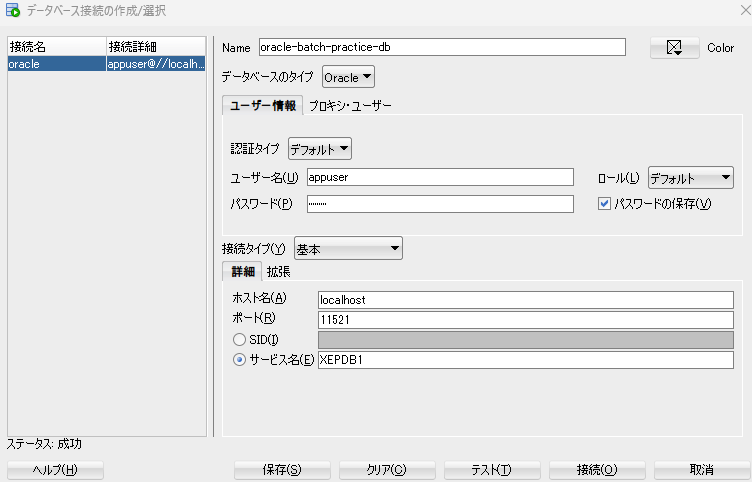

# ストアド と バッチ処理（Oracle版）

## 0. Oracle環境構築

### コンテナ起動後に以下のコマンドを実行してください
`sudo chown -R 54321:54321 ./infra/oracle/data`

### 上記で上手くいかない場合
#### データ永続化の破棄（初期化スクリプトを再度適用させる）
`docker compose down -v`

#### ホスト側の永続化データも削除
`sudo rm -rf ./infra/oracle/data`

#### ディレクトリ再作成と権限修正（重要）
`mkdir -p ./infra/oracle/data`
`sudo chown -R 54321:54321 ./infra/oracle/data`

##### 再起動
`docker compose up -d`

### SQL Developerの接続設定

## 1. プロジェクト概要

このプロジェクトは、SQLとバッチ処理のスキル向上を目的としています。
Eコマースサイトにおける日次売上データの処理という、簡易なビジネスシナリオを模擬しています。

あなたのミッションは、以下の機能を持つバッチ処理システムを作成することです。

1.  ランダムなテスト用売上データを生成する。
2.  日次の売上データを集計するPL/SQLプロシージャを実行する。
3.  集計したデータを中間テーブル（ワークテーブル）に保存する。
4.  集計データをCSVファイルに出力する。
5.  PowerShellスクリプトで一連の処理を実行できるようにする。

このプロジェクトではOracle DatabaseとPowerShellスクリプトを利用し、環境全体をDockerで管理します。これにより、簡単なセットアップと一貫した実行環境を実現できます。

## 2. データベーススキーマ

データベースは以下のテーブルで構成されます。これはdockerで起動したOracleコンテナ内に自動でセットアップされるため、手動設定は不要です。

### `products` テーブル

すべての商品マスタデータを格納します。

| カラム名 | データ型 | 制約 | 説明 |
| :--- | :--- | :--- | :--- |
| `product_id` | `NUMBER GENERATED BY DEFAULT AS IDENTITY` | `PRIMARY KEY` | 商品のユニークな識別子。 |
| `product_name` | `VARCHAR2(255)` | `NOT NULL` | 商品名。 |
| `price` | `NUMBER` | `NOT NULL` | 商品の単価。 |

### `orders` テーブル

注文情報を格納します。

| カラム名 | データ型 | 制約 | 説明 |
| :--- | :--- | :--- | :--- |
| `order_id` | `NUMBER GENERATED BY DEFAULT AS IDENTITY` | `PRIMARY KEY` | 注文のユニークな識別子。 |
| `order_datetime` | `TIMESTAMP` | `NOT NULL` | 注文が行われた日時。 |

